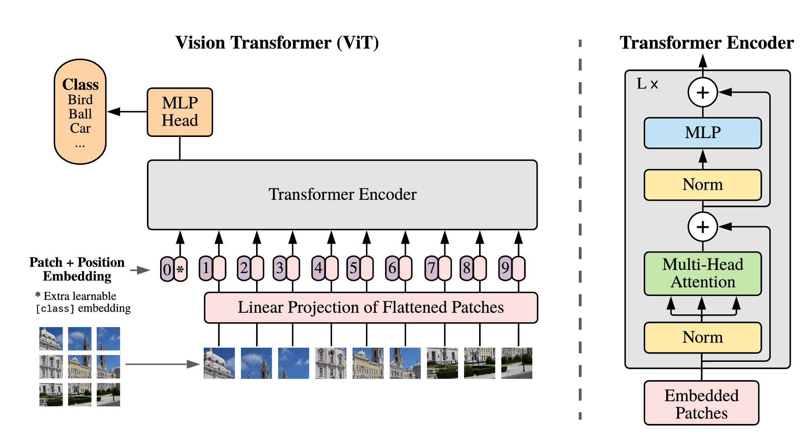

# VisionTransformer

VisionTransformer on CIFAR10 dataset

用pytorch实现VisionTransformer并完成CIFAR10的分类训练

## Model

输入：3x32x32 ----> 3x64x64

+ 每个3x8x8区域做conv转成64宽向量，整个图片变为8x8=64个64宽patch向量.
+ 所有patch向量做linear转patch embedding
+ Class Embedding直接拼到patch embedding序列头部用于最终的分类，Class Embedding可学习
+ Position Embedding可学习（与Transformer不同）




## Install

```
git clone https://github.com/JiaxingSong718/VisionTransformer.git  # clone
cd VisionTransformer
```

## Environment

```
conda create -n VisionTransformer python=3.7
conda activate VisionTransformer
pip install -r requirements.txt  # install
```

## Train

```
python train.py
```

## Inference

```
python inference.py
```

## Reference

[VisionTransformer Paper](https://arxiv.org/pdf/2010.11929)

